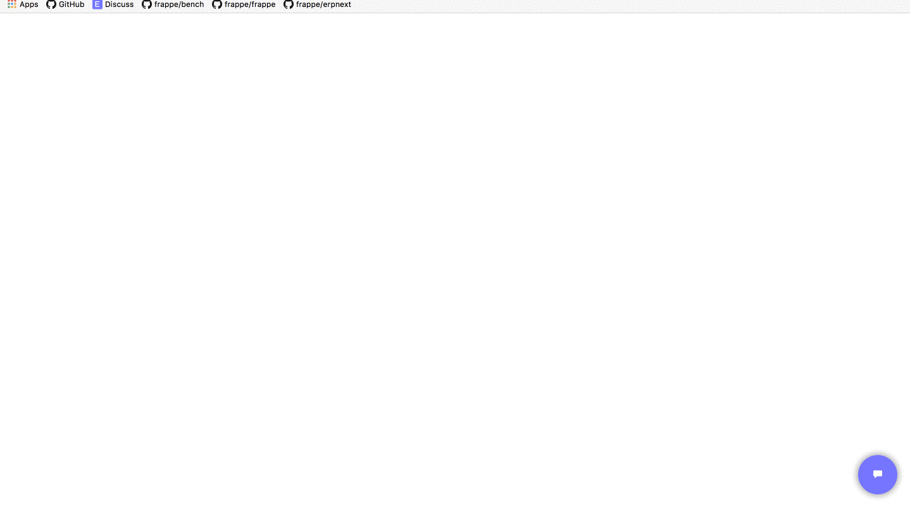

<div align="center">
	<a href="https://achillesrasquinha.github.io/chat">
		<!-- TODO: logo -->
		
	</a>
	<h1>Frappé Chat</h1>
	<p class="center">
		Minimalistic, modern and extensible chat Client + UI Library.
	</p>
</div>



### Table of Contents
* Quickstart
* License

#### Quickstart

```js
var chat = frappe.Chat.Client(`http://${YOUR_HOSTNAME}:${PORT}`)
chat.mount()

chat.on(frappe.Chat.Event.CONNECT, () => {
	console.log('Client: A client just connected.')
})
```

#### License
This repository has been released under the [MIT License](LICENSE)